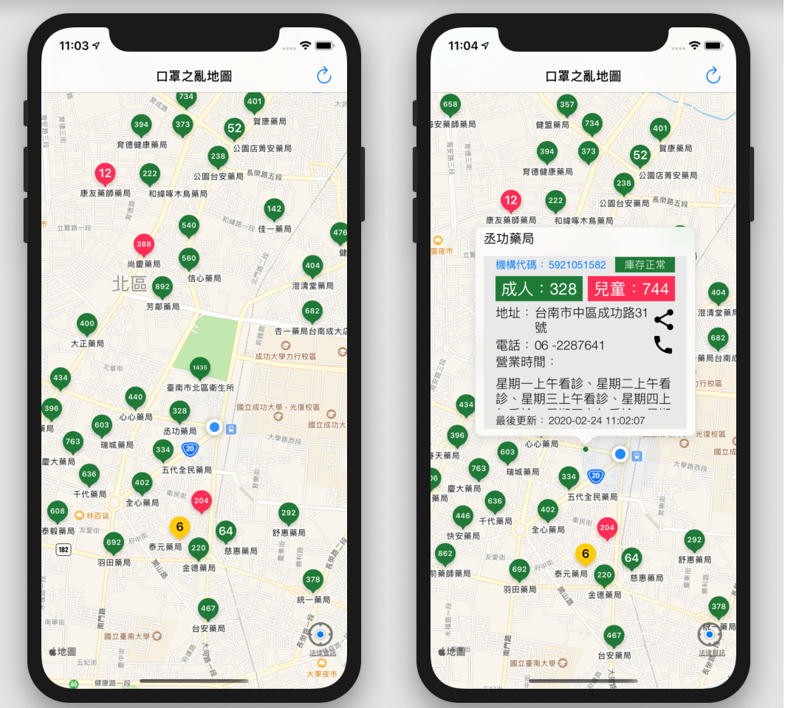

## 口罩之亂地圖 
##### 台灣實名制即時口罩庫存地圖 #####

**如何使用（ How to use）？**

以 Xcode 11 開啟 ``TWMaskData.xcodeproj`` ，編譯至 iOS 模擬器/實機執行即可。

Open ``TWMaskData.xcodeproj`` with Xcode. Just build !

**資料來源：**
[健康保險資料開放服務](https://data.nhi.gov.tw/Datasets/DatasetResource.aspx?rId=A21030000I-D50001-001)

**螢幕截圖（Screen Shot）**

